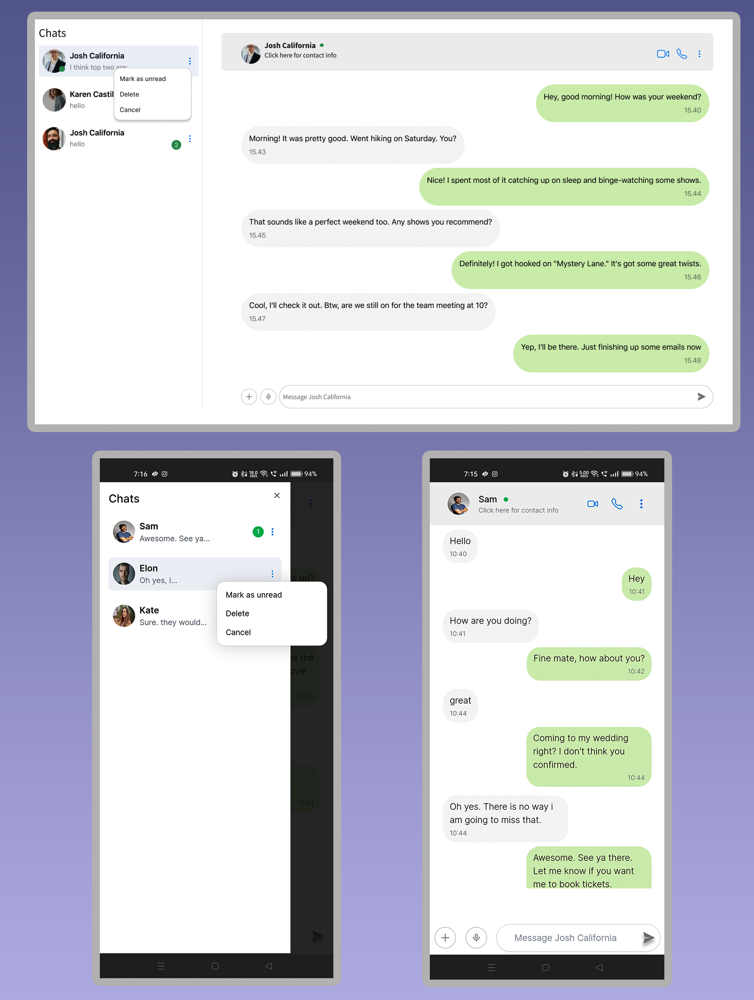

# Basic Chat Ui ⟭

*Easy-to-use chat UI that works with any backend. Makes your app's chat features look good and work well on all devices.*

## ⟭ Starter Project 

### ※ Techs tack
- NextJs
- Tailwind
- Redux
### ※ Installation Guide
> Clone the repo `git clone git@github.com:Subham-Maity/chat-ui-starter.git`
```shell
cd chat-ui-starter

#install
pnpm i 

#run 
pnpm run dev
```


### ※ Features

- **Contact List**: Displays a list of contacts with their names and the most recent message for each contact. Users can mark conversations as unread, delete conversations, or close the modal from the options provided. When a user clicks on a contact and opens the conversation, the count of unread messages disappears. If the user selects "mark as unread" from the modal, the unread message count is displayed again.
- **Conversation View**: Displays the conversation between the user and a selected contact. When a user clicks on a contact, they are redirected to the conversation screen.
- **Responsive Design**: The application is built with a responsive design, ensuring a consistent and optimal experience across different devices and screen sizes.